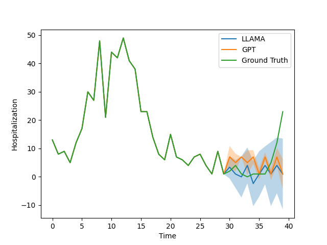

# EpiGPT

Note: Please issue `cd src` as all the commands below should be run from the `src` directory.

## Forecaster
### Installlation

Run the following command to install all dependencies in a conda environment named `llmtime`. Change the cuda version for torch if you don't have cuda 11.8. 
```
source install.sh
```
After installation, activate the environment with
```
conda activate llmtime
```
If you prefer not using conda, you can also install the dependencies listed in `install.sh` manually. 

Finally, add your openai api key to `~/.bashrc` with
```
echo "export OPENAI_API_KEY=<your key>" >> ~/.bashrc
```


Now run
`pip install -r requirements.txt`

### Running the code

```bash
./run_epi.sh
```

### Results and plots
```
python evaluate_epi.py
```

Plots are saved in `epi_plots` directory.

### Example plot




## Summarizer

Try the three different difficulty levels of prompts in Epi2Text, and you can make any LLM summarize the 2023 ILINet data.